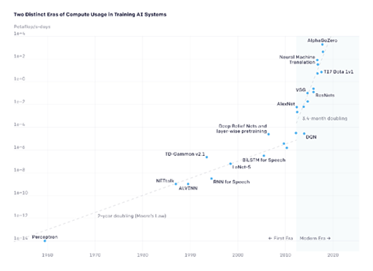

# Maximal Computing

## Problems of Proportionality

We use "maximal computing" to refer to any **computationally
intensive work**, including working with blockchains, Big Data, and
Machine Learning (ML) and other types of Artificial Intelligence (AI).
Such systems are everywhere these days. For example, AI technologies
have been applied to speech recognition, natural language processing,
computer vision, and many other areas. In many parts of the world, AI is
present within our homes, cars, mobile phones. New applications of AI
are being implemented with the help of large publicly open datasets,
available on the web (for example open crawl), which in turn are fed to
models trained with huge hardware capabilities (training on GPUs and
TPUs). Such maximal computing may help with adaptation to climate
change; Gordon S. Blair gives the example of flooding resilience:

> The challenges facing flood risk management practitioners are considerable as they make long-term decisions, e.g., about investments in flood defenses, with limited budgets. \[\...\] Thanks to developments in digital technology, though, major changes are now anticipated, in particular related to the plethora of data becoming available (cf. big data)---from satellite imagery, from sensors deployed around catchments (cf. the Internet of Things), from detailed studies carried out by local authorities, from citizen science, and from mining data from the web.
>
> [(Blair 2020)](https://www.zotero.org/google-docs/?zFLY7a)

Maximal computing is an important part of STEM research, but it is also growing within the arts and humanities (e.g. interest in generative models such as GPT-3 and Stable Diffusion). While it is well-recognised that global warming results from carbon and other greenhouse gases, broader AI communities have been slow to understand the relevance of our activities. As Knowles et. al (2021) note:

> A serious and proportional response to the climate emergency would \[\...\] involve constraining energy demand and mitigating drivers of infrastructure growth, and as a result, also consuming less energy. In real terms for computing, this means manufacturing fewer devices, storing and processing less data, generally managing with less compute power; and in terms of technical ambitions, scaling back the Internet of Things, resisting the temptation to throw AI and blockchain at every problem, and breaking free of the cycle of ever increasing demand for computation.
>
> [(Knowles et al. 2021)](https://www.zotero.org/google-docs/?F97CYH)

How do we decide whether a computational process is **proportionate** to
the benefits it may create? In other words, when *does* it become
appropriate to 'throw AI and blockchain' at a problem? Can the
underlying goals of computationally intensive work sometimes be met in
different ways? And when we do decide to use computationally intensive
processes, how can we optimise them from a climate and sustainability
perspective?

NEED HIGHER QUALITY PIC
*Compute needed to train state-of-the-art models rises
exponentially since \~2012*

## Some easy wins

1. **Don't use it at all.** What are you trying to achieve? Can it be accomplished in another way? 
2. **Don't use it _just_ for fun.** Have fun of course, but also have a purpose in mind, one which would be sufficient even if it _wasn't_ fun.
3. **Use pre-trained models.** There are so many to choose from! And likewise, try to make any models you do train available for others to use. 
4. **Use smaller models.** [Larger models may yield better results](https://arxiv.org/abs/2001.08361), but often a smaller one will still do everything you need.
5. **Don't overtrain your model.** You don't need to keep teaching the model something it learned 50 steps ago.
6. **[Raise awareness of the issue.]**(https://arxiv.org/abs/1906.02243)
7. **Where possible, do it on-site.** If your institution has High Performance Computing (HPC) facilities that you can access, there may be greater opportunities for collaboration and optimisation, compared to renting your compute off Amazon, Google or Microsoft.
8. **Support responsible use with UX design.** If you are building something, that may mean making it deliberately *less* fascinating and immersive. In this space, user engagement in itself is not a measure of success. 

## Then it gets complicated

The easy wins are not enough, and things quickly get complicated. Here are a few factors to take into account, when considering proportionality.

1. **Ethics**: The underlying purpose of a project has bearing on how we assess its proportionality. Are its goals related to sustainability? Optimizing planting patterns for beleaguered pollinators, calling out greenwashing in corporate disclosures at scale, tailoring communications relating to famine relief? Or perhaps the goals are good in themselves, but unrelated to climate adaptation, or are maladaptive. 
 
Or perhaps (as sometimes seems to crop up in AI research) the goals themselves are pure evil. The ethics of AI is a very rich field. Prominent themes include bias (e.g. gender, race, language, class, geography, disability), opacity (is AI explainable? If so, who explains and who listens?), and broader considerations of justice. The [Critical Algorithm Studies reading
list](https://socialmediacollective.org/reading-lists/critical-algorithm-studies/) and [Zotero Library](https://www.zotero.org/groups/605005/critical_algorithm_studies) contain further reading on the politics and ethics of AI and algorithms more broadly.  [The Data
Hazards](https://datahazards.com/contents/hazards/high-environmental-cost.html)
project is developing labels that seek to communicate the risks involved
in Data Science approaches, from concerns about privacy to high
environmental cost: 'Considering worst case scenarios is one part of
this puzzle. Worst case scenarios free us from trying to predict the
future: we're not saying that something *will* happen' [(Thurlby,
Natalie and Di Cara, Nina
2021)](https://www.zotero.org/google-docs/?M2lk73).

2. **Potential Benefits**: What is the potential benefit that might be realised? 

3. **How likely is it to succeed?** This is a question you can ask at multiple scales, e.g. a project, a model, a query. 

4. **Optimization**: How lean was the software building process / is the software? Are there ways to improve or to green it (i.e. reduce resource consumption)? Can computationally intensive jobs be scheduled for when the sun is shining and the wind is blowing?

Focusing on Natural Language Processing, Strubell et al. (2019) recommend
"a concerted effort by industry and academia to promote research of more
computationally efficient algorithms, as well as hardware that requires
less energy" as well as the development and promotion of "easy-to-use
APIs implementing more efficient alternatives to brute-force grid search
for hyperparameter tuning, e.g. random or Bayesian hyperparameter search
techniques" [(Strubell, Ganesh, and McCallum
2019)](https://aclanthology.org/P19-1355/)

5. **Openness**: Are you using maximal computing in ways that can benefit other researchers and creators? 


Perhaps it's time for some new types of open licenses, that aim to influence the carbon impact of derivative software and applications? We are of course deeply in favour of open practice. Nonetheless, even here there may be negative considerations too. In some cases a project may be justified by its proportionate use of maximal computing, yet if shared inappropriately, will predictably result in unjustifiable variants.


6. **Monitoring**: Where is HPC use monitored in your institution? What kind of data is collected, and who gets to see it? Monitoring maximal computing may help to identify where use is suboptimal or disproportionate to what the job is trying to achieve. Maximal computing resources are often denominated in hours of core use. Can it instead be denominated in CO2e?

7. **Affordances**: If you are building something, does it encourage or enforce responsible use?

## Measures of Efficiency

Machine Learning models are can be measured using metrics like T-scores,
confusion matrices, accuracy, recall, Area under the ROC curve, LOGLOSS
(Minaee 2019). It is becoming more common to see the literature report
on the electricity and environmental consumption required for advanced
maximal computational research. Some useful environmentally relevant
metrics to consider when planning your AI research projects are:

- Floating point operations (FPO), in FLOPS, GigaFlops
- Processor utilisation (%), % use of CPU/GPU/TPU
- Electricity consumption, in Watt Hours (Wh)

Lacoste, Luccioni and Schmidt have been researching environmental
impacts of AI and ML, and have developed an online open source [Machine
Learning CO2 impact calculator](https://mlco2.github.io/impact). 
This is an important tool to help our understanding of the emissions of
ML based humanities research.

## Red AI and Green AI


*"The vital first step toward more equitable and green AI is the clear
and transparent reporting of electricity consumption, carbon emissions,
and cost. You can't improve what you can't measure."*

Jesse Dodge, Allen Institute for AI, coauthor of [Green
AI](https://cacm.acm.org/magazines/2020/12/248800-green-ai/fulltext).


In 2020, the Association for Computing Machinery (ACM) suggested that to
measure efficiency of AI models we need to report on the amount of
*work* required. This includes the work to train the model, tune the
hyperparameters and retrain the model repeatedly in however many
iterations you use.  Understanding the costs for a single document, 
the size of the data set and the steps in your pipeline (such as 
preprocessing, cleaning, and enriching) helps you to comprehend the
total work required, and thus allows you to optimise at specific points
in your pipeline. Red AI refers to the dominant approach, that seeks to 
improve results through massive computational power without regard
to environmental impact. Striving to "treat efficiency as a primary evaluation
criterion alongside accuracy" is what Schwartz et. al. call Green AI.

## Mini case study {#case-study}



### **GPT-n workshops case study**

Recently I gave some workshops to introduce participants to GPT-n text generators. The workshops usually involved an activity in which participants fine-tune a pre-trained model using texts of their choosing.

There were good pedagogic reasons to let everyone choose their own input text, e.g. from Gutenberg, for the fine tuning: it turns the activity into a more exciting experiment. It also made sense for me to do the activity myself, because (1) it\'s easy to forget details when you\'re describing something from memory and notes, and (2) I know from experience that certain fine-tuning texts will \"work well,\" so we would have at least one interesting output to discuss at the end.

But in the short time available, I noticed participants often chose arbitrary and / or \"obvious\" input texts (e.g. Shakespeare, or an author they were primed to choose because they had been mentioned earlier in the workshop). Likewise, pushed for prep time, I realised I was tending to use the same input texts again and again. Furthermore, I would generate hundreds of pages of text, and then only browse the first few - and never use the rest for anything.

My new rule of thumb: **if I am running a computationally intensive process for educational or demo purposes, do so in a way that doubles as research** (in a loose sense of \"research\").

For the latest iteration of the workshop I have:                     

- Explicitly included discussion of carbon costs.
- Used a recording of myself doing the fine-tuning and text generation.
- Created a shared folder of potential fine-tuning inputs which I am interested in for various reasons - participants could choose one of these or pick their own.
- Built in time to discuss actual immediate use cases of text generation, and what questions we might ask of the output (and how many pages we needed to generate).

In some ways the workshop felt clunkier, and I had to cut some content which I liked. But it still felt worth it to include very basic sustainability considerations.

If I run similar workshops in the future I hope to:

- Find out more about the actual carbon footprint of these processes.
- Explore a format where small groups collaborate, running just one fine-tuning per group.
- Explore choosing from a variety of already fine-tuned models, rather than running new fine-tunings.                                                                     
- Seek out others who may already want synthetic texts based on specific fine-tuning inputs, and offer to do this for them as part of the workshop.
- Continue to think about proportionality, and if the carbon cost does seem too high, then replace the workshop with something else entirely.

I don\'t think that the energy savings will be extensive. When I think of all the users of art AIs, generating thousands and thousands of images just out of curiosity or a playful compulsion, it feels like a drop in the ocean. But it also feels important to model responsible behaviour. A minimal set of principles for using AI to generate text or art might involve:

- Spend the time to articulate what I am trying to do and why (not just "to try it out" or "to see what happens").
- Whenever possible, combine different purposes (try out an experimental approach in a way that may also contribute to a particular project, etc.).
- Whenever possible, work in an open and shared way, so that others can benefit from my use of the AI.



## Adapting existing infrastructures {#adapting-infras}

Large organisations such as Higher Education Institutes (HEIs) or other
public sector organisations require complex IT infrastructure to satisfy
their diverse stakeholder requirements. For example, a university will
typically have a central IT service offered out across different
academic departments but some departments will also run their own more
specialised services. Service catalogues provide a way for organisations
to describe what technologies and services they support and could be a
good starting point to communicate their environmental footprints. This
may then be used to raise awareness or feed into data management plans
when describing the infrastructure requirements for a new research
project. A simple colour-coded gradient scheme could be used to help
categorise the technologies and services similar to the ones you see on
electrical appliances (or other schemes).

As more organisations shift their infrastructure from always on Virtual
Machines (VMs) to more on-demand compute services we should start to see
benefits in energy consumption, especially in large organisations that
have budgeted for VMs that might run with minimal use for periods of
time. We will move to a model that is more elastic and can scale
horizontally to accommodate changes in demand. Cloud providers such as Amazon have started to provide their own carbon footprint [calculators](https://aws.amazon.com/blogs/aws/new-customer-carbon-footprint-tool/).

We are also seeing a shift towards using Content Delivery Networks
(CDNs) which can provide in-memory caches of popular resources avoiding
the requirement to do expensive transfers across backend systems.
Understanding the computation or energy benefits from these caches would
provide useful insight.

Within software development projects it is typical to see CI/CD
pipelines being deployed. We need to raise awareness of the impacts of
continually triggering what might be a resource intensive process.

## Further reading

Schwartz, Roy, Jesse Dodge, Noah A. Smith, and Oren Etzioni. '[Green AI](https://doi.org/10.1145/3381831)'. *Communications of the ACM* 63, no. 12 (17 November 2020): 54--63.

Shervin Minaee, [20 Popular Machine Learning
Metrics](https://towardsdatascience.com/20-popular-machine-learning-metrics-part-1-classification-regression-evaluation-metrics-1ca3e282a2ce). *Towards Data Science*, 28 Oct 2019. [Accessed 2022-04-06].

Strubell, Emma, Ananya Ganesh, and Andrew McCallum. 2019. [‘Energy and Policy Considerations for Deep Learning in NLP’].(https://doi.org/10.18653/v1/P19-1355) In Proceedings of the 57th Annual Meeting of the Association for Computational Linguistics, 3645–50. Florence, Italy: Association for Computational Linguistics. https://doi.org/10.18653/v1/P19-1355.

